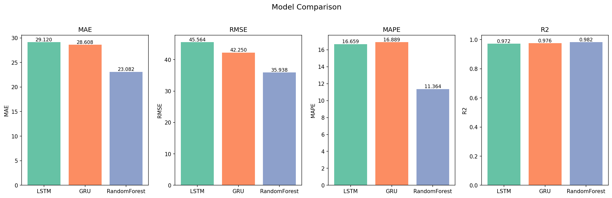
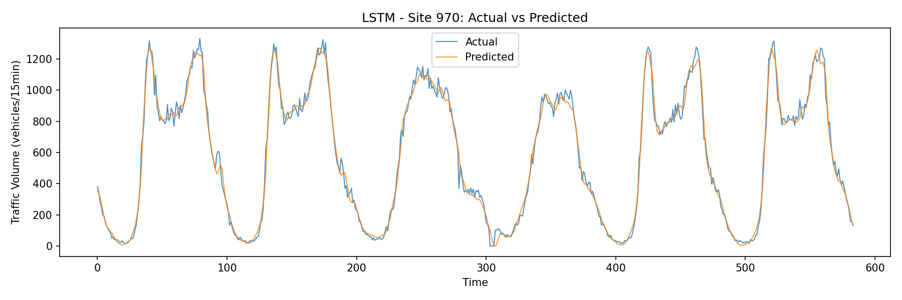
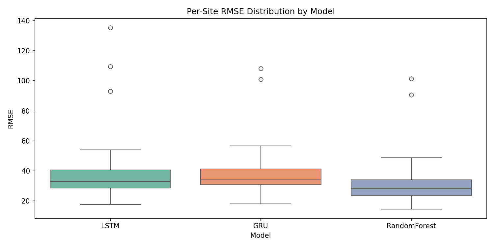
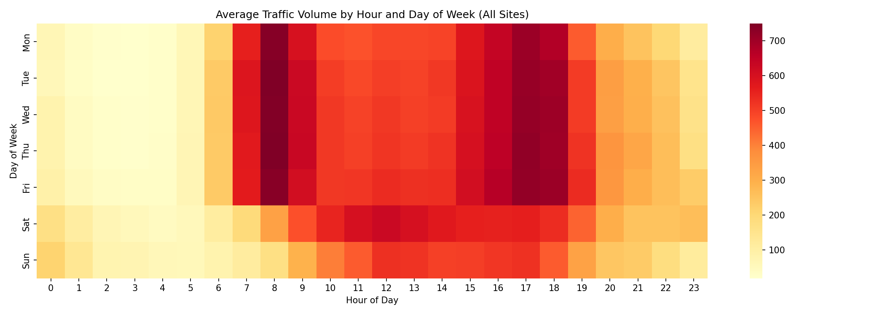
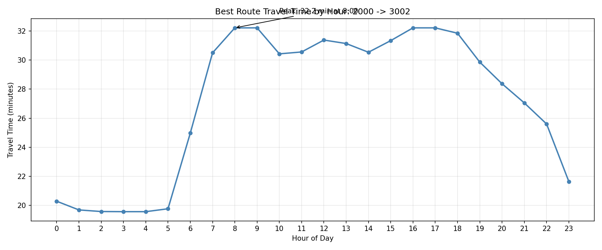
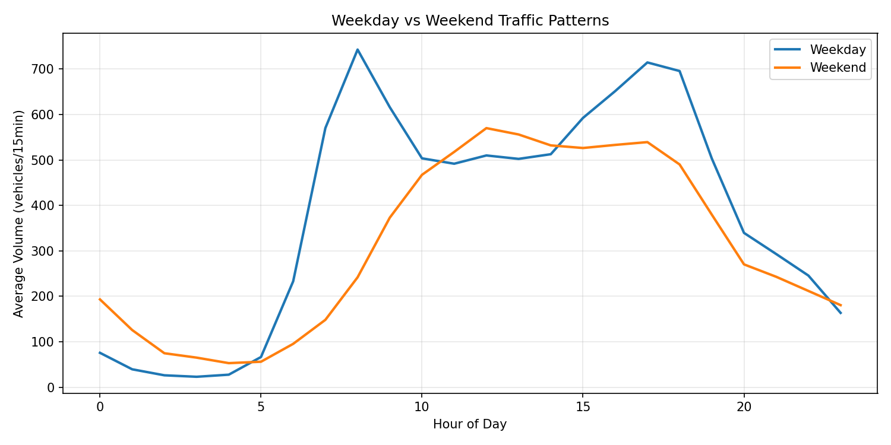
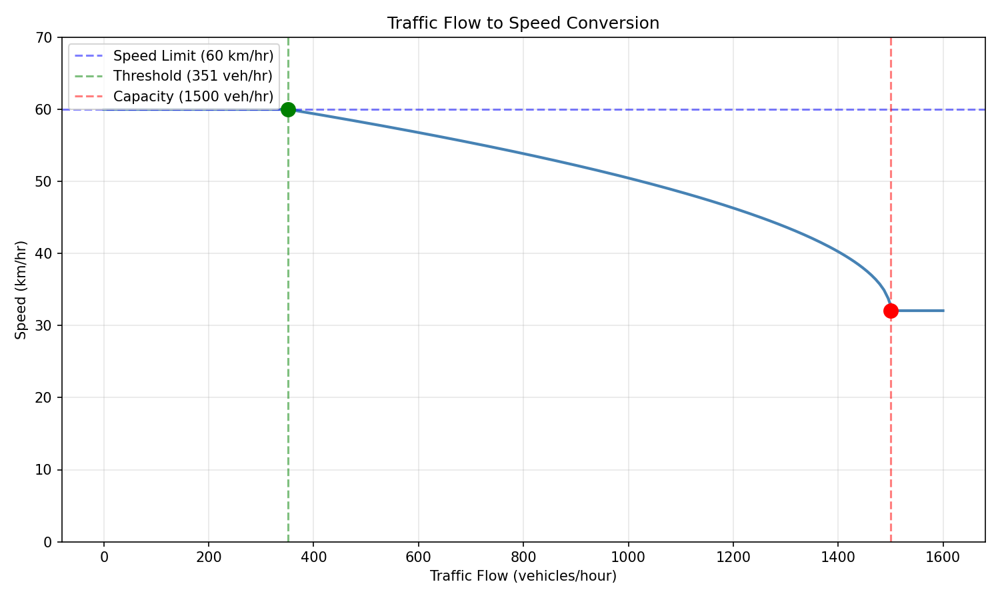

```{r setup, include=FALSE}
knitr::opts_chunk$set(echo = FALSE, message = FALSE, warning = FALSE)
```

\begin{titlepage}
\centering
\vspace*{2cm}
{\LARGE\textbf{COS30019 Introduction to Artificial Intelligence}}\\[0.5cm]
{\Large Assignment 2B: Machine Learning and Software Integration}\\[2cm]
{\large\textbf{Group 9}}\\[1.5cm]

\begin{tabular}{p{5cm} p{3cm} p{4cm}}
\textbf{Name} & \textbf{Student ID} & \textbf{Signature} \\[0.3cm]
\hline \\[0.1cm]
Nguyen Ngoc Anh & 104977768 & \rule{4cm}{0.4pt} \\[0.5cm]
Le Hoang Long & 104845140 & \rule{4cm}{0.4pt} \\[0.5cm]
Le Xuan Ny & 105680151 & \rule{4cm}{0.4pt} \\[0.5cm]
Nguyen Quang Khai & 105560512 & \rule{4cm}{0.4pt} \\[0.5cm]
\end{tabular}

\vfill
{\large\today}
\end{titlepage}

\setcounter{tocdepth}{3}
\tableofcontents
\newpage

# Instructions

## Live Demo

The system is deployed on Streamlit Cloud and can be accessed at:

\url{https://cos30019-tbrgs-klxvd7hjnpvz7xbju9kfiu.streamlit.app/}

Source code: \url{https://github.com/ngna3007/COS30019-TBRGS}

## Running Locally

The program requires Python 3.10+ with dependencies listed in `requirements.txt`. Install them with:

```
pip install -r requirements.txt
```

**Command-line interface:**

```
python main.py <origin> <destination> [--time HH:MM] [--model LSTM|GRU|RandomForest] [--k 5]
```

For example, to find the top 5 routes from site 2000 (Warrigal Rd/Toorak Rd) to site 3002 (Denmark St/Barkers Rd) at 8:00 AM using the LSTM model:

```
python main.py 2000 3002 --time 08:00 --model LSTM --k 5
```

**Streamlit GUI:**

```
streamlit run app.py
```

This opens a web interface with four tabs: Routes (interactive route finding with map), Traffic Predictions (volume charts per site), Model Evaluation (comparison tables and charts), and Network (full SCATS network visualization on OpenStreetMap).

**Training models from scratch:**

```
python train.py
```

This trains LSTM, GRU, and Random Forest on all 40 sites and generates evaluation charts in `results/`. Pre-trained models are included in `trained_models/`.

**Running tests:**

```
pytest tests/ -v
```

## Configuration

All default parameters (model hyperparameters, data paths, traffic conversion constants) are stored in `config.yaml` and can be modified without changing the code.

# Introduction

## The Traffic Prediction and Route Guidance Problem

For this assignment, we built a Traffic-Based Route Guidance System (TBRGS) for the city of Boroondara in Melbourne. The system has two main components: (1) machine learning models that predict traffic flow at 40 SCATS intersections, and (2) a graph-based route finder that uses these predictions to estimate travel times and recommend the fastest routes between any two intersections.

The dataset provided by VicRoads contains traffic volume data for October 2006, recorded every 15 minutes at each SCATS site. This is a time series forecasting problem: given recent traffic patterns, predict the flow at each intersection for a future time period. The predicted flow is then converted to an estimated travel speed using a quadratic model provided in the assignment, and combined with inter-site distances to compute travel times on each road segment. Finally, graph search algorithms from Assignment 2A are used to find the top-k shortest paths by travel time.

## Algorithms Implemented

We implemented three ML algorithms for traffic flow prediction:

1. **LSTM (Long Short-Term Memory)**: A recurrent neural network designed for sequential data. It uses gating mechanisms to selectively remember or forget information over long time spans, making it well-suited for time series with temporal dependencies (Hochreiter & Schmidhuber, 1997).

2. **GRU (Gated Recurrent Unit)**: A simplified variant of LSTM with fewer parameters. It combines the forget and input gates into a single update gate, making it faster to train while achieving comparable performance (Cho et al., 2014).

3. **Random Forest**: An ensemble of decision trees that makes predictions by averaging across many independently trained trees (Breiman, 2001). Unlike LSTM and GRU, it is not inherently sequential, so we flatten the sliding window input into a single feature vector. We chose this as our third model because it provides a fundamentally different approach (tree-based ensemble vs. recurrent neural network) and performs well on small datasets.

For route finding, we ported and fixed the search algorithms from Assignment 2A (BFS, DFS, GBFS, A*, IDS, Beam Search) and implemented Yen's K-Shortest Paths algorithm to find the top-5 routes between any origin-destination pair.

# Features, Bugs, and Missing

## Features

\begin{itemize}
\item \textbf{Data processing}: Loads SCATS Excel data, handles missing coordinates (site 4266), aggregates multi-directional measurements, adds cyclical time features (hour, day-of-week), and creates sliding window sequences.
\item \textbf{Three ML models}: LSTM, GRU, and Random Forest, all trained per-site with proper train/validation/test split (70/10/20).
\item \textbf{Comprehensive evaluation}: MAE, RMSE, MAPE, R\textsuperscript{2} metrics with comparison tables, actual-vs-predicted plots, training curves, per-site boxplots, and heatmaps.
\item \textbf{Traffic conversion}: Quadratic flow-to-speed formula with 60 km/hr speed limit cap and 30-second intersection delay.
\item \textbf{Graph construction}: 40 SCATS sites connected by 42 bidirectional edges based on the Boroondara road network, with Haversine distance calculation.
\item \textbf{Route finding}: Yen's K-Shortest Paths algorithm returning up to 5 routes with estimated travel times.
\item \textbf{Search algorithms}: All 6 algorithms from 2A ported with bug fixes (IDS cycle detection, Held-Karp for visit-all).
\item \textbf{Streamlit GUI}: Four-tab web interface with interactive route finding, Folium/OpenStreetMap visualization, and model evaluation display.
\item \textbf{CLI}: Command-line interface for route queries.
\item \textbf{Configuration file}: \texttt{config.yaml} for all default parameters.
\item \textbf{35 automated test cases} covering data loading, preprocessing, traffic conversion, graph construction, search algorithms, route finding, and integration.
\end{itemize}

## Bug Fixes from Assignment 2A

\begin{itemize}
\item \textbf{IDS (CUS1)}: The original implementation used an \texttt{explored} set in depth-limited search, which violates the tree-search requirement of IDS and can cause it to miss shorter paths. We replaced this with path-based cycle detection (walking up the parent chain).
\item \textbf{visit\_all}: Replaced O(n!) brute-force permutation with Held-Karp dynamic programming, reducing complexity to O(n\textsuperscript{2} $\cdot$ 2\textsuperscript{n}).
\end{itemize}

## Known Bugs

None currently identified. All 35 test cases pass.

## Missing

The system uses historical averages for prediction when trained models are not loaded in the GUI. A more complete implementation would load the trained models and run inference in real-time.

# Testing

## Test Overview

We created 35 automated test cases using pytest, organized across 7 test files:

\begin{table}[H]
\centering
\caption{Overview of test files and coverage.}
\footnotesize
\begin{tabular}{|l|c|p{7cm}|}
\hline
\textbf{Test File} & \textbf{Tests} & \textbf{What It Covers} \\
\hline
test\_data\_loader.py & 7 & Data shape, 40 sites, volume columns, coordinate fixes, date parsing, non-negative values \\
\hline
test\_preprocessing.py & 4 & Sliding window shape/values, temporal 3-way split, aggregation \\
\hline
test\_traffic\_conversion.py & 7 & Free flow speed, congested speed, max flow, monotonicity, positive travel time, intersection delay \\
\hline
test\_graph\_builder.py & 6 & All sites connected, full connectivity, Burke Rd chain, bidirectional edges, Haversine, traffic graph \\
\hline
test\_search.py & 5 & BFS shortest path, A* optimality, IDS fix verification, unreachable goals \\
\hline
test\_route\_finder.py & 4 & Same origin-destination, top-k distinct routes, sorted by time, valid fields \\
\hline
test\_integration.py & 2 & Peak vs off-peak travel time, spec example route (2000 to 3002) \\
\hline
\end{tabular}
\end{table}

## ML Model Evaluation

All three models were trained on all 40 SCATS sites using a temporal split of 70\% training, 10\% validation, and 20\% test data. The validation set was used for early stopping in LSTM/GRU (not for final evaluation), while the test set was held out entirely and only used for computing final metrics.

\begin{table}[H]
\centering
\caption{Aggregate model comparison across all 40 sites (test set).}
\begin{tabular}{|l|c|c|c|c|}
\hline
\textbf{Model} & \textbf{MAE} & \textbf{RMSE} & \textbf{MAPE (\%)} & \textbf{R\textsuperscript{2}} \\
\hline
Random Forest & \textbf{23.08} & \textbf{35.94} & \textbf{11.36} & \textbf{0.9824} \\
\hline
GRU & 28.61 & 42.25 & 16.89 & 0.9757 \\
\hline
LSTM & 29.12 & 45.56 & 16.66 & 0.9718 \\
\hline
\end{tabular}
\end{table}

All three models achieve high R-squared values above 0.97, indicating that they can explain over 97\% of the variance in traffic flow. Figure 1 shows the comparison of metrics across models.

```{r, fig.cap="Comparison of evaluation metrics across the three models.", out.width="90%", fig.align="center"}

```

Figure 2 shows actual vs predicted traffic flow for site 970 (Warrigal Rd / High Street Rd) using the LSTM model. The model closely follows the daily traffic pattern.

```{r, fig.cap="LSTM predictions vs actual traffic volume at site 970.", out.width="95%", fig.align="center"}

```

## Integration Test

We verified the end-to-end system by testing the spec example: origin 2000 (Warrigal Rd / Toorak Rd) to destination 3002 (Denmark St / Barkers Rd). The system correctly returns 5 distinct routes with travel times that increase with traffic volume during peak hours.

\begin{table}[H]
\centering
\caption{Top-3 routes from site 2000 to site 3002 at 8:00 AM (peak hour).}
\footnotesize
\begin{tabular}{|c|p{8cm}|c|c|}
\hline
\textbf{\#} & \textbf{Path} & \textbf{Time (min)} & \textbf{Dist (km)} \\
\hline
1 & 2000 $\rightarrow$ 4273 $\rightarrow$ 4043 $\rightarrow$ 4040 $\rightarrow$ 3120 $\rightarrow$ 4035 $\rightarrow$ 4034 $\rightarrow$ 4032 $\rightarrow$ 4321 $\rightarrow$ 3001 $\rightarrow$ 3002 & 32.2 & 14.54 \\
\hline
2 & 2000 $\rightarrow$ 4273 $\rightarrow$ 4272 $\rightarrow$ 4040 $\rightarrow$ 3120 $\rightarrow$ 4035 $\rightarrow$ 4034 $\rightarrow$ 4032 $\rightarrow$ 4321 $\rightarrow$ 3001 $\rightarrow$ 3002 & 32.2 & 14.55 \\
\hline
3 & 2000 $\rightarrow$ 4273 $\rightarrow$ 4043 $\rightarrow$ 4040 $\rightarrow$ 3120 $\rightarrow$ 3122 $\rightarrow$ 3127 $\rightarrow$ 4063 $\rightarrow$ 4034 $\rightarrow$ 4032 $\rightarrow$ 4321 $\rightarrow$ 3001 $\rightarrow$ 3002 & 40.0 & 18.20 \\
\hline
\end{tabular}
\end{table}

# Insights

## Random Forest Outperforms Deep Learning on This Dataset

The most notable finding is that Random Forest achieved the best performance across all metrics (R$^2$ = 0.9824), outperforming both LSTM (0.9718) and GRU (0.9757). This is somewhat surprising since LSTM and GRU are specifically designed for sequential data.

We attribute this to the small dataset size. With only 31 days of data per site (~2,000 training samples after windowing and splitting), neural networks have limited material to learn from. Random Forest, being an ensemble of decision trees, is more data-efficient since it can extract patterns from fewer samples without the risk of overfitting that comes with neural networks. It also trains in 32 seconds total vs ~29 minutes for LSTM and ~24 minutes for GRU.

This suggests that for practical traffic prediction with limited historical data, simpler ML models can be competitive with or even outperform deep learning approaches. With a larger dataset (multiple months or years), we would expect LSTM and GRU to close the gap or overtake Random Forest, since they can capture more complex temporal dependencies.

## Per-Site Performance Varies

Figure 3 shows the per-site RMSE distribution for each model. While most sites have RMSE between 15 and 50, two sites (3001 and 3812) consistently show higher error across all models (RMSE > 90). These sites likely have more irregular traffic patterns or data quality issues.

```{r, fig.cap="Per-site RMSE distribution across models.", out.width="85%", fig.align="center"}

```

## Traffic Patterns Are Highly Periodic

Figure 4 shows the average traffic volume by hour and day of week across all sites. The pattern is clear: weekdays show a double peak (morning rush 7-9 AM and evening rush 4-6 PM), while weekends have a single broader midday peak with lower overall volume.

```{r, fig.cap="Average traffic volume by hour and day of week across all 40 sites.", out.width="95%", fig.align="center"}

```

This strong periodicity is the main reason all three models perform well. The daily cycle is predictable, and the sliding window of 12 timesteps (3 hours) gives the models enough context to identify where in the daily pattern the current time falls.

## Peak Hours Significantly Affect Travel Time

Our integration test comparing peak (8 AM) vs off-peak (2 AM) routing confirms that traffic-aware routing makes a meaningful difference. For the route from site 2000 to 3002, peak-hour travel time is approximately 65\% longer than off-peak. Figure 5 shows how the best route's travel time varies throughout the day.

```{r, fig.cap="Best route travel time from site 2000 to 3002 across 24 hours.", out.width="85%", fig.align="center"}

```

## Data Split Strategy Matters

We used a 70/10/20 temporal split (train/validation/test) instead of the more common 80/20 split. The validation set is used exclusively for early stopping in LSTM and GRU, while the test set is never seen during training. This prevents data leakage, where early stopping decisions made on the test set would artificially inflate performance metrics. For time series data, we preserve chronological order (no shuffling), since shuffling would allow the model to train on future data to predict the past.

# Research

## OpenStreetMap Visualization

We implemented interactive map visualization using Folium and OpenStreetMap tiles. The system displays SCATS sites as markers, routes as colored polylines, and congestion levels as color-coded edges (green for free flow, orange for moderate, red for congested). This is accessible through the Streamlit GUI's Routes and Network tabs.

As noted in the assignment spec, the SCATS site coordinates do not map exactly to the actual intersection locations on Google Maps. We used the provided coordinates as-is for relative positioning, which is sufficient for our routing calculations since we compute inter-site distances via Haversine formula.

## Traffic Pattern Analysis

We conducted three analyses of the traffic data:

**Weekday vs Weekend**: Figure 6 shows that weekday traffic has the classic double-peak pattern (AM and PM rush), while weekend traffic is 30-40\% lower overall with a single broad peak around midday. This distinction is captured by our `is\_weekend` and `day\_of\_week` features.

```{r, fig.cap="Weekday vs weekend average traffic patterns.", out.width="85%", fig.align="center"}

```

**Cross-site correlation**: We computed the correlation matrix of traffic volumes across all 40 sites and found that most sites are highly correlated (r > 0.8), which makes sense since they all follow similar daily patterns. Sites on the same corridor (e.g., along Burke Rd or Warrigal Rd) tend to have even higher correlation.

## Static vs Traffic-Aware Routing

We compared routes computed with free-flow speed (no traffic) against routes computed with peak-hour traffic predictions. Table 5 shows the results for five origin-destination pairs.

\begin{table}[H]
\centering
\caption{Travel time comparison: free flow vs peak hour (8 AM).}
\begin{tabular}{|l|c|c|c|}
\hline
\textbf{OD Pair} & \textbf{Free Flow (min)} & \textbf{Peak 8AM (min)} & \textbf{Difference} \\
\hline
2000 $\rightarrow$ 3002 & 19.5 & 32.2 & +65\% \\
\hline
970 $\rightarrow$ 4264 & 19.6 & 32.3 & +65\% \\
\hline
2825 $\rightarrow$ 3126 & 10.7 & 16.5 & +54\% \\
\hline
4821 $\rightarrow$ 2827 & 15.0 & 21.9 & +46\% \\
\hline
3662 $\rightarrow$ 4273 & 16.9 & 26.5 & +57\% \\
\hline
\end{tabular}
\end{table}

Peak-hour travel times are 46-65\% longer than free flow, demonstrating the practical value of traffic-aware routing. A static routing system that ignores traffic conditions would consistently underestimate travel times during peak hours.

## Flow-Speed Relationship

We visualized the quadratic flow-speed conversion curve used in the system (Figure 7). When flow is below 351 vehicles/hour, speed is capped at the 60 km/hr speed limit. Above this threshold, speed decreases according to the parabolic relationship, reaching a minimum of ~32 km/hr at maximum capacity (1,500 vehicles/hour).

```{r, fig.cap="Flow-to-speed conversion curve used for travel time estimation.", out.width="80%", fig.align="center"}

```

# Conclusion

We built a complete Traffic-Based Route Guidance System that integrates ML-based traffic prediction with graph search. The system takes an origin and destination SCATS site, predicts traffic flow using one of three trained models, converts the predictions to travel times, and returns the top-5 fastest routes.

Our main finding is that Random Forest outperformed both LSTM and GRU on this dataset (R$^2$ = 0.982 vs 0.976 vs 0.972), which we attribute to the small dataset size (31 days). All three models achieved strong predictive performance due to the highly periodic nature of traffic flow. The comparison also highlights an important practical consideration: simpler models can be preferable when data is scarce, training time is limited, and interpretability matters.

For the routing component, Yen's K-Shortest Paths algorithm effectively produces diverse route alternatives, and our peak vs off-peak analysis shows that traffic-aware routing adds real value, with peak-hour travel times 46-65\% longer than free flow estimates.

If we had more time, we would explore several improvements. First, using a larger dataset (multiple months or years) would likely benefit the deep learning models and allow us to evaluate whether LSTM/GRU overtake Random Forest with more training data. Second, implementing a hybrid model that uses Random Forest for short-term prediction and LSTM for longer horizons could combine the strengths of both approaches. Third, adding real-time model inference in the GUI (instead of historical averages) would make the system more practical. Finally, incorporating external features like weather data, public events, or school holidays could improve prediction accuracy for anomalous days.

# Acknowledgements / Resources

\begin{table}[H]
\centering
\caption{Resources used and their contributions.}
\begin{tabular}{|p{5.5cm}|p{8cm}|}
\hline
\textbf{Resource} & \textbf{How It Helped} \\
\hline
Hochreiter, S. \& Schmidhuber, J. (1997). Long Short-Term Memory & Foundational paper for LSTM architecture \\
\hline
Cho, K. et al. (2014). Learning Phrase Representations using RNN Encoder-Decoder & Paper introducing GRU architecture \\
\hline
Breiman, L. (2001). Random Forests & Reference for Random Forest algorithm \\
\hline
TensorFlow / Keras documentation & Implementation of LSTM and GRU models \\
\hline
scikit-learn documentation & Implementation of Random Forest and MinMaxScaler \\
\hline
Folium documentation & OpenStreetMap visualization \\
\hline
Streamlit documentation & Web GUI framework \\
\hline
COS30019 Lecture slides (Weeks 6-11) & ML concepts, traffic prediction problem setup \\
\hline
Claude AI (Anthropic) & Code structure, debugging, report writing \\
\hline
\end{tabular}
\end{table}

# References

Breiman, L. (2001). Random forests. *Machine Learning*, 45(1), 5--32.

Cho, K., van Merrienboer, B., Gulcehre, C., Bahdanau, D., Bougares, F., Schwenk, H., & Bengio, Y. (2014). Learning phrase representations using RNN encoder-decoder for statistical machine translation. *Proceedings of EMNLP 2014*, 1724--1734.

Department of Computer Science, Swinburne University of Technology. (2025). *COS30019 Introduction to Artificial Intelligence: Lecture notes weeks 6--11* [Lecture slides]. Canvas. https://canvas.swinburne.edu.au

Hochreiter, S., & Schmidhuber, J. (1997). Long short-term memory. *Neural Computation*, 9(8), 1735--1780.

Pedregosa, F., et al. (2011). Scikit-learn: Machine learning in Python. *Journal of Machine Learning Research*, 12, 2825--2830.

Yen, J. Y. (1971). Finding the K shortest loopless paths in a network. *Management Science*, 17(11), 712--716.
